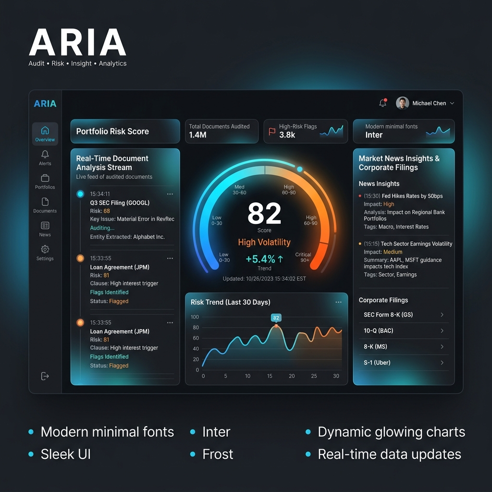
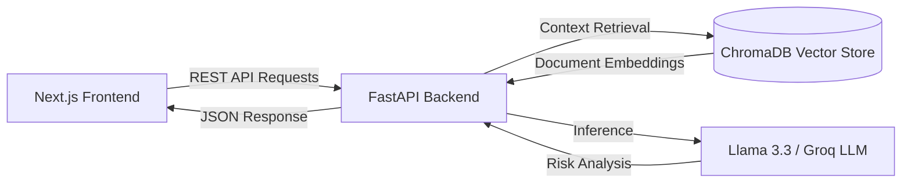

# ARIA: Professional Risk Audit Infrastructure

A high-performance system for institutional risk intelligence. It cross-references forensic financial documentation with global market data to identify structural and clinical risks.

[](https://github.com/sarvesh-raam/ARIA/actions)
[](https://aria-intelligence.vercel.app)
[](https://opensource.org/licenses/MIT)

---

## Executive Summary
ARIA (Autonomous Risk Intelligence Agent) provides high-fidelity financial and structural auditing. The system automates the detection of anomalies within corporate and clinical reports by integrating Retrieval-Augmented Generation (RAG) and deterministic inference models.

👉 **Optimized for low-latency responses, generating structured outputs within 30 seconds.**

## Interface & Output Preview

> *Placeholder: Add your UI screenshot in the `assets` folder as `ui-screenshot.png`*


> *Placeholder: Add your Output screenshot in the `assets` folder as `output-screenshot.png`*

## Deployment
- **Frontend**: Deployed on Vercel [View Live Dashboard](https://aria-intelligence.vercel.app)
- **Backend Model**: Hosted on Hugging Face Spaces

## Architecture Diagram

```text
Frontend (React / Next.js)
        ↓
FastAPI Backend
        ↓
ChromaDB (Vector DB)
        ↓
LLM (Groq)
```

<details>
<summary>View detailed dependency graph</summary>


</details>

## System Design
- Handles document ingestion pipeline
- Uses vector search for efficient retrieval
- Optimized API responses for low latency

## System Architecture & Components
- **Frontend**: Next.js 14 dashboard providing real-time data streaming via Server-Sent Events (SSE).
- **Backend API**: Python FastAPI layer handling requests, orchestration, and integrations.
- **Forensic RAG Infrastructure**: ChromaDB vector storage combined with specialized sentence-transformer embeddings to query complex PDF reports.
- **LLM Intelligence Mesh**: High-performance inference via Groq/Llama 3.3 70B for institutional reasoning.
- **Strategic Pulse Gateway**: Real-time integration with NewsAPI for external risk fusion.

## API Flow
1. **Document Ingestion (`/api/v1/upload`)**: PDF files are uploaded, chunked, and embedded into ChromaDB.
2. **Risk Query (`/api/v1/analyze`)**: The frontend sends an analysis request.
3. **Retrieval**: The backend performs semantic search against the vector database to retrieve highly relevant chunks.
4. **Market Context**: External APIs (e.g., NewsAPI) are pinged for live market conditions.
5. **LLM Evaluation**: Retrieved text and market data are processed by the LLM to compute a Risk Score (0-100).
6. **Streaming Response**: Results are streamed back to the frontend using Server-Sent Events.

## Example Output Payload
```json
{
  "status": "success",
  "data": {
    "risk_score": 82,
    "classification": "High Volatility",
    "findings": [
      "Inconsistent debt-to-equity ratio reported in Section 3.2.",
      "Recent market news indicates supply chain disruptions affecting raw material costs."
    ],
    "confidence_level": 0.94
  }
}
```

## Interface Preview
*(Insert Dashboard Screenshots Here)*
- Dashboard Overview
- Real-Time Risk Analysis View

## Environment & Deployment

### Hardware & Engine Requirements
- Python 3.9+ Runtime
- Node.js 18+ (LTS) 
- External API Gateways: Groq, NewsAPI

### Infrastructure Initialization
**A. Backend Intelligence Service (FastAPI)**
```bash
cd backend
python -m venv venv
source venv/bin/activate
pip install -r requirements.txt
python main.py
```

**B. Frontend Analytic Dashboard (Next.js)**
```bash
cd frontend
npm install
npm run dev
```

## Technical Roadmap
- Multi-Agent Orchestration: Implementation of graph-based reasoning loops to increase detection accuracy.
- SEC/EDGAR Integration: Direct ingestion of institutional filings via Ticker-based indexing.

## License
Distributed under the MIT License. Professional use only.
